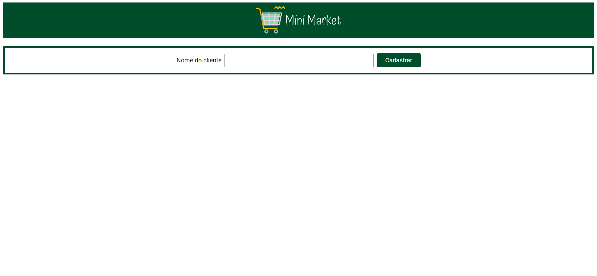
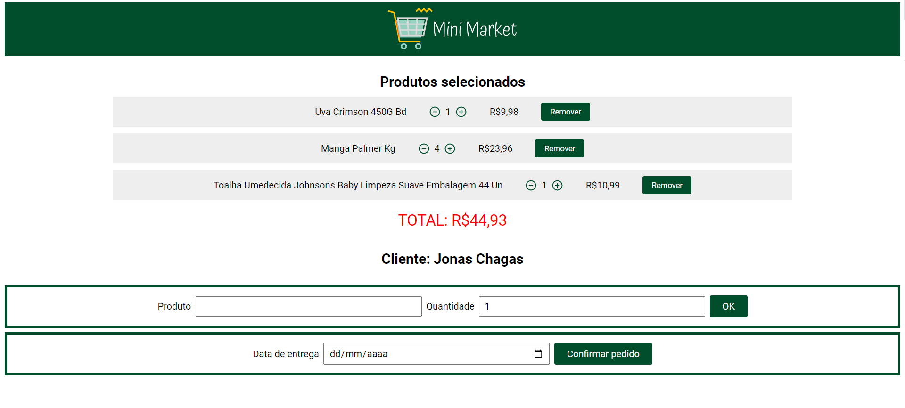
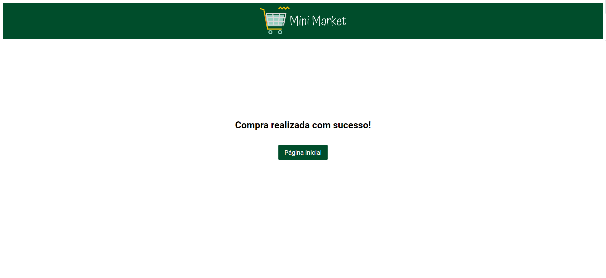

# Mini Market

This is an exercise to practice some of the following technologies:
* React.js
* Styled-components
* API consumption

Data was consumed from an API Rest developed by me. The link of the github repository is: https://github.com/francinehahn/mini-market-backend

## Functionalities
* To register a new client or select one of the registered clients;
* To add the product to cart and select the units;
* To delete the products added to cart;
* To increse and decrease the product units in the cart;
* To visualize the total price of the products added to cart;
* To see all the items added to cart even after loading the page;
* To complete an order;
* After completing the order, the shopping cart is emptied; 

## Link Surge

## Images

 

 

